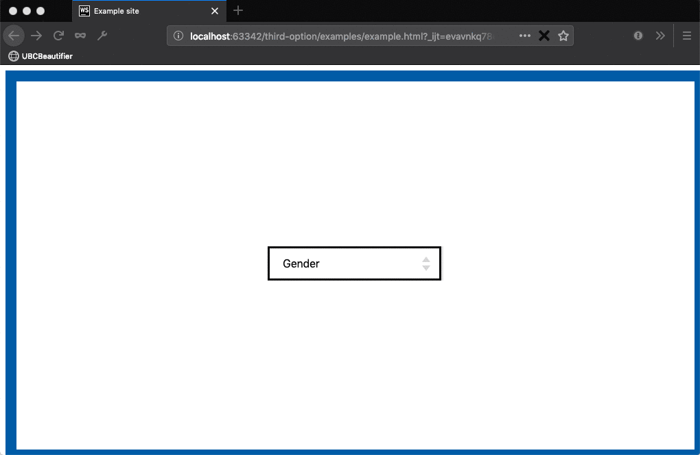

This is my project for StacsHack 2019. I hacked it together by myself over 24 hours, so enjoy the code :P

Companies by and large do a bad job of collecting gender and sex information over the internet. They ask for it even if it isn't relevant, leaving room for bias and data misuse. They also fail to provide adequate options for [nonbinary](https://nonbinary.wiki/wiki/Nonbinary) folk. 
This browser extension forces them to do better! The idea is to bypass any validation of gender done in your browser. And many websites will fail to do any validation on the server, just letting you submit a form without picking "Male" or "Female". 

The extension will automatically detect form fields that might be susceptible, when it does, an "X" will appear in the URL bar. If you click it and the form fields will be edited. You can then go ahead and try to submit the form and cross your fingers. 

## How it works
The extension scans the DOM every few seconds for `<select>` and `<input type="radio" />`. For each one it finds, it will determine if it is likely requesting gender/sex/title and verify that it offers no "other" options.

When you click the "X", a script runs to try to fix all the inputs found previously. It's pretty hacky, but it should make the new input a proper part of the form in most websites. And as long as the page doesn't have any JS that validates the field or updates it (eg. React stuff), the form will be transmitted with an 'other' value to the server.

## Proxy server
For completeness and fun I have added the functionality to edit the actual POST requests on the fly. This circumvents all client side validation. This won't work with GET requests yet, but those can actually be done entirely in browser (I think), so they shouldn't be hard to add in.

If you double tap the "X" icon, it will turn red. This means proxying is enabled. You will need to have the proxy server running for this to work (due to limitations in the web extension API). While the icon is red, outgoing requests will be scoured for gender and sex fields in the browser. If they contain such fields, the request will be sent along to the proxy server which will edit it and pass it along.

Proxying is enabled and disabled on a per tab basis, so you don't need to worry about sending all data through my hack.
